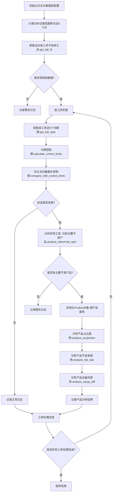

# 生产线不良率（Fail Status）分析项目文档

## 一、项目概述

本项目是一个生产线不良率自动化分析工具，旨在通过每日自动计算、分析生产线各工序的不良率数据，判定工序是否异常，并对异常工序进行根因分析（如主要不良产品识别、产品占比及不良率趋势分析、设备差异分析），最终通过日志记录分析结果，为生产线质量管控提供数据支持。

## 二、核心功能模块

### 1. 日志管理模块

- **功能**：配置程序运行日志，支持文件存储与控制台输出，可分别设置日志级别，确保分析过程可追溯。

- **实现函数**：`setup_logger`

- **关键特性**：
  
  - 日志文件自动按大小切割（默认10MB/文件，保留5个备份）
  - 区分文件日志与控制台日志级别（默认均为INFO，测试环境可设为DEBUG）
  - 标准化日志格式：`时间 - 日志级别 - 消息`（如`2024-05-20 10:30:00 - INFO - 程序开始运行`）
  - 支持中文编码（`encoding='utf-8'`）

### 2. 数据获取模块

- **功能**：从数据库查询不良率相关数据，包括当日汇总数据、历史趋势数据及产品-设备关联数据。

- **核心函数**：
  
  - `get_fail_ttl`：获取指定日期、指定工序列表的当日不良率汇总（按工序分组）
  - 输入参数：数据库配置、日期（`workdt`）、工序列表（`operList`）、日志器
  - 输出：包含`oper_old`（工序）和`fail`（当日不良率%）的DataFrame
  - `get_fail_oper`：获取指定工序近6个月的月度数据（用于计算控制限）
  - 输入参数：数据库配置、工序（`oper`）、起始日期（`dt_semiYear`）、结束日期（`yesterday`）、日志器
  - 输出：包含`dt`（年月）、`in_qty`（投入量）、`fail`（月度不良率%）的DataFrame

- **数据来源**：
  
  - 生产数据：`cmsalpha.db_yielddetail`（包含`oper_old`、`workdt`、`in_qty`、`out_qty`等字段）
  - 产品属性数据：`modulemte.db_deviceinfo`（包含`Product_Mode`、`Tech_Name`等产品属性，与生产数据通过`device`字段关联） 

### 3. 控制限计算与异常判定模块

- **功能**：基于历史数据计算工序不良率的合理波动范围（控制限），并判定当日数据是否异常。

- **核心函数**：
  
  - `calculate_control_limits`：使用P控制图公式计算控制限
  - 输入：工序历史数据（包含`in_qty`和`fail`字段的DataFrame）、日志器
  - 计算逻辑：
  1. 清洗数据：过滤`in_qty=0`或`fail`为空的无效记录
  
  2. 计算平均不良率 $\bar p$：加权平均值，按投入量加权
  
  3. 计算平均样本量$n_{avg}$：历史投入量的平均值
  
  4. 计算控制限：
     
     $$
     UCL = \bar{p} + 3 \times \sqrt{\frac{\bar{p} \times (1-\bar{p})}{n_{avg}}} \quad \text{（上控制限）}
     $$
     
     $$
     LCL = \max\left(\bar{p} - 3 \times \sqrt{\frac{\bar{p} \times (1-\bar{p})}{n_{avg}}}, 0\right) \quad \text{（下控制限，不小于0）}
     $$
  - 输出：`(p_bar_pct, LCL_pct, UCL_pct)`（平均不良率、下控制限、上控制限，均为百分比）
  - `compare_with_control_limits`：对比当日数据与控制限，判定工序状态
  - 输入：当日不良率汇总（`df_ttl`）、工序（`oper`）、控制限（`LCL`/`UCL`）、日志器
  - 判定逻辑：
  - 若当日不良率 > UCL → 状态为“异常（偏高）”
  - 若当日不良率 < LCL → 状态为“异常（偏低）”
  - 若控制限计算失败 → 状态为“无法判定”
  - 若无当日数据 → 状态为“无数据”
  - 其他情况 → 状态为“正常”
  - 输出：包含判定结果的字典（示例：`{'oper': '5600', 'status': '正常', 'message': '当日不良率(2.3%)在控制范围内'}`）

### 4. 异常工序分析模块

- **功能**：当工序判定为异常时，定位主要不良原因（产品维度），基于“加权不良率”筛选关键产品。

- **核心函数**：`analyze_abnormal_oper`

- **分析逻辑**：
  
  1. 按产品属性（`Product_Mode`/`Tech_Name`/`Die_Density`等）分组，统计各产品当日的投入量、产出量及不良率
  
  2. 计算**加权不良率**（核心指标）： 
     
     $$
     加权不良率 = \frac {产品投入量} {工序总投入量} × 产品不良率
     $$
     
     （兼顾产量占比和不良率，避免“高不良率但低产量”或“高产量但低不良率”的产品被误判）
  
  3. 帕累托分析（80/20规则）：按加权不良率降序排序，筛选累计占比≤80%的产品作为“主要不良产品”

- **输入输出**：
  
  - 输入：数据库配置、异常工序（`oper`）、异常日期（`workdt`）、日志器
  - 输出：`(analysis_df, vital_factors_df)` 

- `analysis_df`：全量产品分析数据（含加权不良率、累计占比） 

- `vital_factors_df`：主要不良产品数据（累计加权不良率≤80%）

### 5. 产品级深度分析模块

- **功能**：对“主要不良产品”进行多维度趋势分析，定位产品自身的不良率波动原因。

- **实现类**：`Product`（封装产品属性及分析方法，通过产品6大核心属性唯一标识）
  
  | 核心属性              | 说明              |
  | ----------------- | --------------- |
  | `product_mode`    | Mode            |
  | `tech_name`       | Tech            |
  | `die_density`     | PKG Density     |
  | `product_density` | Product Density |
  | `module_type`     | Module Type     |
  | `grade`           | Grade           |

- **核心方法**：
  
  1. `analyze_proportion`：产品在工序中的占比趋势分析
  - 逻辑：计算产品每月投入量占工序总投入量的比例，通过线性回归斜率判断趋势（逐渐增加/降低/稳定）
  - 输出：`proportion_result`（含趋势结论、斜率、月度数据）
  2. `analyze_fail_rate`：产品自身不良率趋势分析
  - 逻辑：计算产品每月不良率，通过线性回归及显著性检验（p值）判断趋势（改善/恶化/稳定）
  - 关键指标：半年度平均不良率、最高不良率及月份、每月平均变化率、首尾月变化幅度
  - 输出：`failrate_result`（含趋势结论、KPI指标、月度数据）
  3. `analyze_equip_diff`：产品在工序各设备间的不良率差异分析
  - 逻辑：通过**卡方检验**判断设备间不良率是否存在显著差异（原假设：设备间无差异）
  - 判定标准：p值 < 0.05 → 存在显著差异，同步输出不良率最高的设备
  - 输出：`equip_diff_result`（含检验结论、统计量、设备详细数据）

### 6. 主程序流程控制

- **功能**：调度各模块执行，完成从数据获取到异常分析的全流程。

- **实现函数**：`main`

- **核心流程**：
  
  1. 初始化：日志配置（区分测试/生产环境）、数据库连接参数设置
  2. 日期计算：默认分析“昨天”数据，历史数据取近6个月（从半年前月初至昨天）
  3. 数据获取：获取当日各工序不良率汇总（`df_ttl`）
  4. 工序级分析：
  - 逐工序获取近6个月数据，计算控制限
  - 对比当日数据与控制限，判定状态
  5. 异常处理：
  - 对异常工序，调用`analyze_abnormal_oper`识别主要不良产品
  - 对主要不良产品，依次执行占比趋势、不良率趋势、设备差异分析
  6. 日志记录：全流程关键节点及结果通过日志输出

### 三、程序运行流程



### 四、关键技术与算法

| 技术/算法     | 应用场景         | 核心逻辑                                   |
| --------- | ------------ | -------------------------------------- |
| P控制图      | 控制限计算        | 基于3σ原则，通过历史数据计算不良率的合理波动范围（UCL/LCL）     |
| 帕累托分析     | 主要不良产品识别     | 按加权不良率排序，筛选累计贡献80%的关键产品                |
| 线性回归      | 趋势判断（占比/不良率） | 通过斜率判断趋势方向（增加/降低），结合数据量判断可靠性           |
| 显著性检验（p值） | 不良率趋势/设备差异判定 | p值 < 0.05 → 趋势/差异具有统计显著性（默认显著水平α=0.05） |
| 卡方检验      | 设备间不良率差异分析   | 检验“设备与不良率独立”的原假设，拒绝原假设则认为设备间存在显著差异     |
| 加权计算      | 不良产品优先级排序    | 加权不良率 = 产量占比 × 不良率，平衡产量和不良率的影响         |

## 五、使用说明

### 1. 环境配置

- **运行环境**：Python 3.x，需安装依赖库：`pandas`、`sqlalchemy`、`numpy`、`scipy`、`python-dateutil`

- **数据库**：支持MySQL（通过`pymysql`驱动连接）

### 2. 运行方式

```python
# 直接执行脚本，默认使用测试环境
if __name__ == '__main__':
main('test') # 'test'为测试环境，'prod'为生产环境
```

### 3. 核心参数配置

| 参数位置                 | 参数名                   | 说明                                             |
| -------------------- | --------------------- | ---------------------------------------------- |
| `setup_logger`       | `max_bytes`           | 日志文件最大大小（默认10MB）                               |
| `setup_logger`       | `backup_count`        | 日志备份文件数量（默认5个）                                 |
| `main`               | `log_path`            | 日志存储路径（默认`C:/Users/Tengjun Zhao/Desktop`）      |
| `main`               | `operList`            | 需分析的工序列表（默认`['5600', '5710', '5700', '5780']`） |
| `analyze_proportion` | `trend_threshold`     | 占比趋势判定阈值（默认0.01，斜率绝对值超过此值则判定为“增加/降低”）          |
| `analyze_fail_rate`  | `stability_threshold` | 不良率趋势判定阈值（默认0.3%/月，斜率超过此值则判定为“改善/恶化”）          |

### 4. 结果查看

- 分析结果通过日志输出，包含：
  
  - 当日各工序状态（正常/异常）
  - 异常工序的主要不良产品清单
  - 产品的占比趋势、不良率趋势及设备差异分析结论

- 日志文件路径：`log_path`配置的目录，文件名格式为`YYYYMMDD.log`

## 六、可扩展与优化方向

- **可视化增强**：集成`matplotlib`或`plotly`生成控制限走势图、趋势对比图、设备差异热力图等，提升结果可读性。

- **自动报告生成**：支持输出HTML/PDF格式的分析报告，包含关键指标、异常点及根因总结。

- **多维度分析**：新增班次、物料批次、操作人员等维度的不良率分析，扩展根因定位能力。

- **智能预警**：基于历史异常模式，新增机器学习模型预测潜在异常（如不良率突增预警）。

- **通知机制**：异常发生时自动推送邮件/企业微信通知，支持@相关负责人。

- **历史对比**：建立异常案例库，自动关联当前异常与历史相似案例，辅助快速排查。

## 七、附录：核心数据结构示例

- **产品分析结果（`failrate_result`）**
  
  ```python
  {
  "conclusion": "Product[P100 TECH_7nm 100 200 MOD1 A] 不良率趋势：改善，平均不良率 2.3450%",
  "kpi": {
  "半年度平均不良率（%）": 2.3450,
  "最高不良率（%）及月份": (3.56, "202401"),
  "每月平均变化率（%/月）": -0.25,
  "首尾月变化幅度（%）": -15.67
  },
  "monthly_data": DataFrame(包含每月dt、sum_in、sum_out、fail_rate)
  }
  ```

- **设备差异分析结果（`equip_diff_result`）**
  
  ```python
  {
  "conclusion": "Product[P100 TECH_7nm 100 200 MOD1 A] 在工序 5600 的设备间不良率存在显著差异（卡方值=12.34，p值=0.005，自由度=3），表现最差设备为 EQP01（不良率 5.67%）",
  "statistic": {
  "chi2": 12.34,
  "p_value": 0.005,
  "dof": 3,
  "significant": True
  },
  "equipment_data": [
  {"设备名": "EQP01", "总投入": 1000, "不良数": 57, "不良率(%)": 5.67},
  {"设备名": "EQP02", "总投入": 1200, "不良数": 30, "不良率(%)": 2.50}
  ]
  }
  ```
