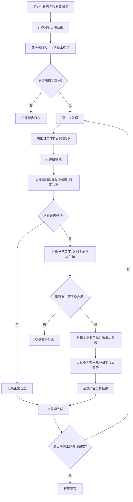

# 生产线不良率（Fail Status）分析项目文档

## 一、项目概述

本项目是一个生产线不良率自动化分析工具，旨在通过每日自动计算、分析生产线各工序的不良率数据，判定工序是否异常，并对异常工序进行根因分析（如主要不良产品识别、产品占比及不良率趋势分析），最终通过日志记录分析结果，为生产线质量管控提供数据支持。

## 二、核心功能模块

### 1. 日志管理模块

- **功能**：配置程序运行日志，支持文件存储与控制台输出，可分别设置日志级别。

- **实现函数**：`setup_logger`

- **关键特性**：
  
  - 日志文件自动按大小切割（默认10MB/文件，保留5个备份）
  
  - 区分文件日志与控制台日志级别（默认均为INFO）
  
  - 包含时间、日志级别、消息的标准化格式
    
    数据获取模块 

### 2. 数据获取模块

- **功能**：从数据库查询不良率相关数据，包括当日汇总数据和历史趋势数据。

- **核心函数**：
  
  - `get_fail_ttl`：获取指定日期、指定工序列表的当日不良率汇总
  - `get_fail_oper`：获取指定工序近6个月的月度数据（投入量、不良率），用于计算控制限

- **数据来源**：数据库表`cmsalpha.db_yielddetail`（生产数据）和`modulemte.db_deviceinfo`（设备与产品属性关联）
  
  ### 

### 3. 控制限计算与异常判定模块

- **功能**：基于历史数据计算工序不良率的控制范围，判定当日数据是否异常。

- **核心函数**：
  
  - `calculate_control_limits`：使用P控制图公式计算控制限
  
  - 计算平均不良率（\bar p）：基于历史数据的加权平均值
  
  - 计算上控制限（UCL）和下控制限（LCL）：
    
    $$
    UCL = \bar p + \frac {3\sqrt{\bar p (1-\bar p)}}{n_{avg}}
    $$
  
  $$
  LCL = max({\bar p - \frac{3\sqrt{\bar p(1-\bar p)}}{n_{avg}}},{0})
  $$
  
  `compare_with_control_limits`：将当日不良率与控制限对比，判定状态（正常/异常偏高/异常偏低/无数据/无法判定）
  
  ### 

### 4. 异常工序分析模块

- **功能**：当工序判定为异常时，定位主要不良原因（产品维度）。

- **核心函数**：`analyze_abnormal_oper`

- **分析逻辑**：
  
  - 按产品属性（`Product_Mode`/`Tech_Name`等）分组统计当日不良率
  
  - 计算**加权不良率**（产量占比 × 原始不良率），兼顾产量和不良率影响
  
  - 基于帕累托原则（80/20规则），筛选累计贡献80%加权不良率的主要产品
    
    ### 

### 5. 产品级趋势分析模块

- **功能**：对主要不良产品进行深度分析，判断其占比及不良率的变化趋势。

- **实现类**：`Product`（封装产品属性及分析方法）

- **核心方法**：
  
  - `analyze_proportion`：分析产品在工序中的月度占比趋势
    
    - 通过线性回归斜率判断趋势（逐渐增加/降低/稳定）
  
  - `analyze_fail_rate`：分析产品自身的月度不良率趋势
    
    - 通过线性回归斜率及显著性检验（p值）判断趋势（改善/恶化/稳定）
    
    - 计算关键指标（半年度平均不良率、最高不良率、每月平均变化率等）
  
  - `analyze_equip_diff`：分析产品设备别差异 
    
    - 通过单因子方差显著性检验（p值）判断差异，找到良率最差的设备
      
      ### 

### 6. 主程序流程控制

- **功能**：调度各模块执行，完成从数据获取到异常分析的全流程。

- **实现函数**：`main`

- **核心流程**：
1. 初始化日志与数据库配置（区分测试/生产环境）

2. 计算分析日期（默认分析“昨天”数据，历史数据取近6个月）

3. 获取当日各工序不良率汇总

4. 逐工序计算控制限并判定当日状态

5. 对异常工序执行根因分析（主要不良产品识别）

6. 对主要不良产品执行趋势分析（占比+不良率）
   
   ## 

## 三、 程序运行流程

## 四、关键技术与算法

- **P控制图**：用于计算不良率的控制限，基于3σ原则（±3倍标准差）

- **帕累托分析（80/20规则）**：识别对不良率贡献最大的少数产品

- **线性回归**：用于趋势判断（占比趋势与不良率趋势）

- **显著性检验**：通过p值判断不良率趋势的统计显著性（默认显著水平α=0.05）

## 五、使用说明

- **运行方式**：直接执行`fail_status_analysis.py`，默认使用测试环境（`main('test')`）

- **环境切换**：修改`main`函数入参为`'prod'`切换至生产环境（数据库主机自动切换）

- **配置修改**：
  
  - 日志路径：修改`main`函数中的`log_path`变量
  
  - 工序列表：修改`main`函数中的`operList`变量（默认`['5600', '5710', '5700', '5780']`）
  
  - 趋势判断阈值：`analyze_proportion`的`trend_threshold`和`analyze_fail_rate`的`stability_threshold`可根据需求调整

## 六、可扩展与优化方向

- **多维度分析**：新增设备、班次、物料批次等维度的不良率分析

- **可视化功能**：集成`matplotlib`或`plotly`生成控制限走势图、趋势图等

- **自动报告生成**：支持输出HTML/PDF格式的分析报告

- **预警机制**：新增邮件/企业微信通知功能，及时推送异常信息

- **历史异常对比**：建立异常知识库，对比当前异常与历史记录的关联性
